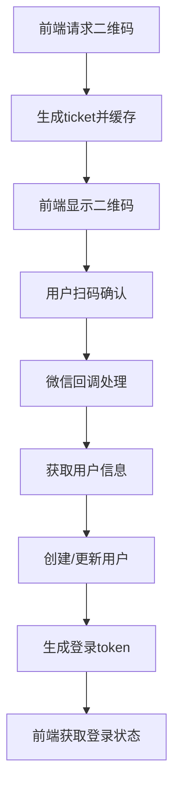

# AIOServer - Java DDD架构项目

基于DDD（领域驱动设计）六边形架构的Java后端项目，集成了微信服务、用户认证和博客管理功能。

## 🏗️ 项目架构

采用**简化DDD六边形架构**，分层清晰：
```
aioserver/
├── api/                    # API层（接口定义）
├── trigger/                # Trigger层（HTTP适配器）
├── domain/                 # Domain层（领域逻辑）
├── infrastructure/         # Infrastructure层（基础设施）
└── types/                  # Types层（通用类型）
```

## 🎯 核心功能

### 1. **Auth认证域**
- 用户注册/登录系统
- 充血模型User实体
- JWT Token认证

### 2. **Blog博客域**
- 博文CRUD管理
- 分类管理
- 分页查询

### 3. **Weixin微信域**
- 微信服务器验证
- 消息接收处理
- 自动回复机制
- **扫码登录功能**（待实现）

## 🔧 技术栈

- **Spring Boot 3.0.2** + **MySQL** + **MyBatis Plus**
- **Guava Cache**（缓存）
- **Retrofit2**（HTTP客户端）
- **XStream**（XML处理）

## 📋 项目限制条件

### 架构限制
- **不使用Maven多模块设计** - 保持单体项目结构
- **不搞复杂的回退实现** - 避免过度复杂的设计
- **不要创建新的响应类** - 必须使用项目中Types层已有的Result类体系

### 技术选择限制
- **数据库** - 使用名为"aioserver"的数据库
- **DDD架构** - 必须按照DDD六边形架构进行标准化
- **统一响应体系** - 使用现有的Result类，不允许创建Response等替代类

## 🚀 快速开始

### 环境要求
- Java 17+
- MySQL 8.0+
- Maven 3.6+

### 运行项目
```bash
# 克隆项目
git clone https://github.com/gaoyifeng02/aioserver.git
cd aioserver

# 配置数据库
# 修改 src/main/resources/application-dev.yml

# 启动项目
mvn spring-boot:run

# 访问接口
curl http://localhost:10001/api/v1/idaas/auth/login
```

## 📱 微信扫码登录分析

### 核心流程

微信扫码登录完整流程包括：



### 关键接口设计

1. **生成二维码接口**
   ```java
   GET /api/v1/login/weixin_qrcode_ticket
   // 返回：ticket用于生成二维码
   ```

2. **检查登录状态接口**
   ```java
   GET /api/v1/login/check_login?ticket=xxx
   // 返回：登录状态和用户token
   ```

3. **微信回调接口**
   ```java
   GET /api/v1/weixin/portal/callback?code=xxx&state=xxx
   // 处理：微信授权回调，完成登录
   ```

### 核心实现技术

- **二维码生成机制**：使用Snowflake算法生成唯一ticket，存入缓存设置过期时间
- **登录状态管理**：ticket作为临时标识，关联登录状态，前端轮询检查
- **微信授权流程**：通过code获取access_token，再获取用户信息，创建/更新用户

### 文件结构参考

完整的扫码登录实现在study项目中：
```
study/s-pay-mall-ddd/
├── LoginController.java (接口入口)
├── WeixinLoginService.java (业务逻辑)
├── LoginPort.java (技术实现)
└── WeixinQrCode*.java (数据模型)
```

### 当前状态

- ✅ **已实现**：微信公众号消息处理、签名验证、XML消息解析
- ❌ **待实现**：主项目中的扫码登录功能（study项目中有完整参考）
- 🎯 **下一步**：将study项目的扫码登录逻辑迁移到主项目

详细分析见：[微信扫码登录分析文档.md](./微信扫码登录分析文档.md)

## 🛠️ 开发工具

### OpenSpec - 规范驱动开发

OpenSpec是一个用于规范驱动开发的AI编程助手工具，帮助团队通过结构化的方式管理需求、设计变更和实施跟踪。

#### 安装OpenSpec

```bash
# 使用npm全局安装
npm install -g openspec

# 或使用yarn
yarn global add openspec

# 验证安装
openspec --version

# 初始化项目
openspec init
```

#### OpenSpec基本使用

1. **查看项目状态**
   ```bash
   openspec list                  # 列出所有活动变更
   openspec list --specs          # 列出所有功能规范
   openspec show [item]           # 查看具体变更或规范的详细信息
   ```

2. **创建新功能提案**
   ```bash
   # 创建新的变更提案（推荐使用verb-noun格式）
   CHANGE=add-weixin-qr-code-login
   mkdir -p openspec/changes/$CHANGE
   ```

3. **验证规范**
   ```bash
   openspec validate [change-id] --strict    # 严格验证变更
   openspec validate --strict                # 验证所有变更
   ```

4. **归档完成的变更**
   ```bash
   openspec archive <change-id> --yes        # 归档已完成的变更
   ```

#### OpenSpec核心功能

1. **变更提案管理**
   - 创建结构化的功能提案
   - 跟踪需求和设计变更
   - 维护实施检查清单

2. **规范管理**
   - 定义功能需求和验收标准
   - 管理技术设计文档
   - 版本控制和归档

3. **工作流集成**
   - 三阶段开发流程（提案→实施→归档）
   - Git集成和PR管理
   - 自动验证和检查

#### OpenSpec命令

```bash
# 基本命令
openspec list                  # 列出活动变更
openspec list --specs          # 列出规范
openspec show [item]           # 显示变更或规范
openspec validate [item]       # 验证变更或规范
openspec archive <change-id>   # 归档完成的变更

# 项目管理
openspec init [path]           # 初始化 OpenSpec
openspec update [path]         # 更新指令文件

# 交互模式
openspec show                  # 提示选择
openspec validate              # 批量验证模式
```

#### OpenSpec目录结构

```
openspec/
├── project.md              # 项目约定
├── specs/                  # 当前事实 - 已构建的内容
│   └── [capability]/       # 单一专注功能
│       ├── spec.md         # 需求和场景
│       └── design.md       # 技术模式
├── changes/                # 提案 - 应该改变什么
│   ├── [change-name]/
│   │   ├── proposal.md     # 为什么、什么、影响
│   │   ├── tasks.md        # 实施检查清单
│   │   ├── design.md       # 技术决策（可选）
│   │   └── specs/          # 增量变更
│   └── archive/            # 已完成的变更
```

### Claude Code - AI编程助手

Claude Code是Anthropic官方的CLI编程助手，提供智能代码生成、调试和项目管理功能。

#### 安装Claude Code

```bash
# 使用npm全局安装
npm install -g @anthropic-ai/claude-code

# 或使用yarn
yarn global add @anthropic-ai/claude-code

# 验证安装
claude-code --version

# 初始化项目
claude-code init
```

#### Claude Code基本使用

1. **项目管理**
   ```bash
   claude-code init             # 初始化项目配置
   claude-code status           # 查看项目状态
   claude-code plan             # 制定开发计划
   ```

2. **代码开发**
   ```bash
   claude-code run              # 运行项目
   claude-code test             # 运行测试
   claude-code build            # 构建项目
   ```

3. **智能辅助**
   ```bash
   claude-code generate         # 基于需求生成代码
   claude-code refactor         # 重构优化代码
   claude-code debug            # 智能调试问题
   claude-code review           # 代码审查
   ```

4. **交互模式**
   ```bash
   claude-code                  # 进入交互模式，可直接对话
   /help                        # 查看帮助命令
   ```

#### Claude Code核心功能

1. **智能代码生成**
   - 基于需求自动生成代码
   - 支持多种编程语言和框架
   - 遵循项目编码规范

2. **项目管理**
   - 自动分析项目结构
   - 依赖管理和版本控制
   - 任务规划和进度跟踪

3. **调试和优化**
   - 智能错误诊断
   - 性能分析和优化建议
   - 代码重构和改进

#### Claude Code命令

```bash
# 基本命令
claude-code init             # 初始化项目
claude-code run              # 运行项目
claude-code test             # 运行测试
claude-code build            # 构建项目

# 开发辅助
claude-code generate         # 生成代码
claude-code refactor         # 重构代码
claude-code optimize         # 优化代码
claude-code debug            # 调试问题

# 项目管理
claude-code status           # 查看项目状态
claude-code plan             # 制定开发计划
claude-code review           # 代码审查
```

## 🔧 开发环境配置

### 数据库配置

```yaml
# application-dev.yml
spring:
  datasource:
    url: jdbc:mysql://localhost:3306/aioserver
    username: root
    password: 123456
```

### 微信配置

```yaml
weixin:
  config:
    token: your-weixin-token
    originalid: your-original-id
    appid: your-appid
    appsecret: your-appsecret
```

## 📊 API接口清单

### 认证接口
```bash
POST /api/v1/idaas/auth/register    # 用户注册
POST /api/v1/idaas/auth/login       # 用户登录
GET  /api/v1/idaas/auth/getUserInfo  # 获取用户信息
```

### 博客接口
```bash
POST /api/v1/blog/add               # 添加博客
GET  /api/v1/blog/getList          # 获取博客列表
PUT  /api/v1/blog/edit             # 编辑博客
DELETE /api/v1/blog/delete          # 删除博客
```

### 分类接口
```bash
POST /api/v1/category/add          # 添加分类
GET  /api/v1/category/getList       # 获取分类列表
PUT  /api/v1/category/edit          # 编辑分类
DELETE /api/v1/category/delete      # 删除分类
```

### 微信接口
```bash
GET  /api/v1/weixin/portal/receive  # 微信服务器验证
POST /api/v1/weixin/portal/receive  # 接收微信消息
```

## 🎯 开发指南

### 代码规范
1. **严格遵循DDD分层架构**
2. **使用统一Result响应体系**
3. **实现充血模型设计**
4. **遵循Port/Adapter模式**

### 提交规范
```bash
# 功能开发
git commit -m "feat: 添加用户认证功能"

# 问题修复
git commit -m "fix: 修复跨域配置问题"

# 文档更新
git commit -m "docs: 更新API文档"
```

### 分支策略
- `main` - 主分支，生产环境代码
- `feature-*` - 功能开发分支
- `hotfix-*` - 紧急修复分支

## 📝 待办事项

- [ ] 迁移微信扫码登录功能到主项目
- [ ] 完善Token安全机制（JWT实现）
- [ ] 添加单元测试和集成测试
- [ ] 集成Redis缓存
- [ ] 添加API文档（Swagger）
- [ ] 实现WebSocket推送登录状态

## 🤝 贡献指南

1. Fork 项目
2. 创建功能分支 (`git checkout -b feature/AmazingFeature`)
3. 提交更改 (`git commit -m 'Add some AmazingFeature'`)
4. 推送到分支 (`git push origin feature/AmazingFeature`)
5. 开启 Pull Request

## 📄 许可证

本项目采用 MIT 许可证 - 查看 [LICENSE](LICENSE) 文件了解详情。

## 📞 联系方式

如有问题或建议，请通过以下方式联系：

- 提交 Issue
- 发送邮件至：gaoyifeng@example.com

---

*基于DDD架构设计，集成现代Java技术栈，为微信生态提供完整的后端服务支持。*