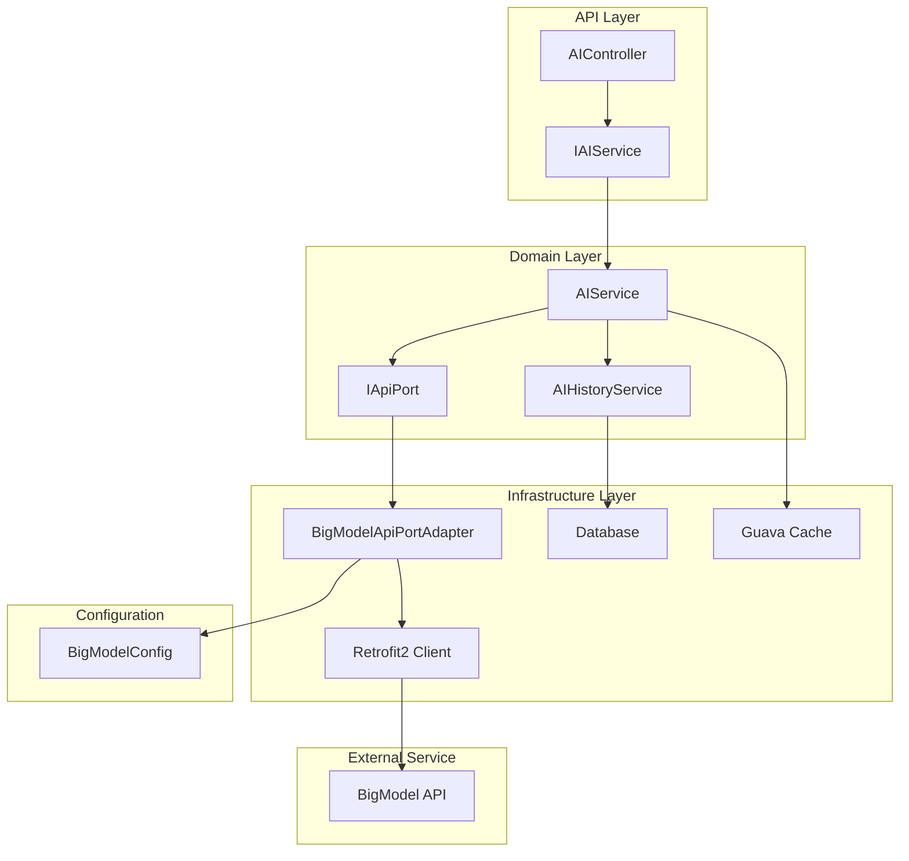

## 上下文
AIOServer是一个基于DDD六边形架构的Spring Boot应用，当前已集成微信API、订单管理和用户认证等功能。需要集成BigModel（智谱清言）AI服务，为平台提供智能对话和内容生成能力。

### 约束
- 必须遵循现有的DDD六边形架构模式
- 使用现有的Result<T>统一响应体系
- 复用现有技术栈：Retrofit2、MyBatis、Guava Cache
- 遵循项目的配置管理和安全规范
- 保持向后兼容性

### 利益相关者
- 开发团队：需要清晰的架构指导和实现模式
- 运维团队：需要配置管理和监控支持
- 最终用户：需要稳定的AI服务体验

## 目标 / 非目标

### 目标
- 提供标准化的AI对话服务接口
- 实现对话历史的持久化存储
- 支持多种AI交互模式（单轮、多轮、流式）
- 集成API认证、限流和错误处理
- 遵循现有DDD架构模式和代码规范

### 非目标
- 不实现自定义AI模型训练
- 不提供复杂的用户权限管理
- 不支持实时语音对话
- 不替代现有的业务逻辑

## 决策

### 决策1：采用独立的AI Service域
**选择**：创建新的`domain/ai/`域，独立管理AI相关业务逻辑
**理由**：
- 符合单一职责原则
- 便于未来扩展其他AI服务
- 与现有域（auth、order、weixin）保持一致
- 支持独立测试和维护

**考虑的替代方案**：
- 将AI功能集成到现有域中 → 违反单一职责，增加耦合度
- 创建独立的微服务 → 增加系统复杂度，不符合单体架构约束

### 决策2：使用Retrofit2作为HTTP客户端
**选择**：复用项目中已有的Retrofit2进行BigModel API调用
**理由**：
- 技术栈统一，减少依赖复杂性
- 已有成熟的配置和错误处理模式
- 团队熟悉度高，学习成本低
- 微信API集成的成功实践

**考虑的替代方案**：
- 使用OkHttp原生客户端 → 增加代码复杂度
- 使用Spring WebClient → 需要额外配置，与现有模式不一致

### 决策3：数据库存储对话历史
**选择**：使用MySQL存储对话历史，Guava Cache缓存最近对话
**理由**：
- 与现有数据存储方案一致
- 支持复杂查询和历史回溯
- MyBatis已集成，开发效率高
- 缓存提升响应性能

**考虑的替代方案**：
- 仅使用内存存储 → 数据丢失风险，不支持历史查询
- 使用Redis存储 → 增加外部依赖，运维复杂度提升

### 决策4：配置管理策略
**选择**：使用Spring Boot配置体系，敏感信息通过环境变量管理
**理由**：
- 与现有配置模式一致
- 支持多环境部署
- 安全性符合最佳实践

## 风险 / 权衡

### 技术风险
**风险**：BigModel API变更导致接口不稳定
**缓解措施**：
- 使用适配器模式隔离API变化
- 实现API版本兼容性检查
- 添加熔断和降级机制

### 性能风险
**风险**：AI API响应时间较长影响用户体验
**缓解措施**：
- 实现异步处理机制
- 添加请求超时配置
- 使用Guava Cache缓存常见查询结果

### 安全风险
**风险**：API密钥泄露导致服务滥用
**缓解措施**：
- 敏感配置使用环境变量
- 实现API调用限流
- 添加请求签名验证

### 成本权衡
**权衡**：开发效率 vs 系统复杂性
- 选择复用现有技术栈提升开发效率
- 接受一定的架构简化以降低复杂性

## 迁移计划

### 阶段1：基础设施搭建
1. 创建AI域的基础结构
2. 实现BigModel API客户端和配置
3. 搭建数据模型和持久化层

### 阶段2：核心功能实现
1. 实现基础对话服务
2. 添加对话历史管理
3. 集成API认证和限流

### 阶段3：高级功能
1. 支持流式响应
2. 添加对话上下文管理
3. 实现批量处理能力

### 阶段4：测试和优化
1. 完善单元测试和集成测试
2. 性能测试和优化
3. 监控和日志完善

### 回滚计划
- 保留原有的API结构，新功能作为增量添加
- 如需回滚，删除新增的AI域相关代码即可
- 数据库变更可通过脚本回滚

## 未决问题

### 配置细节
- BigModel API的具体端点和认证方式
- API调用频率限制和配额管理
- 错误码映射和异常处理策略

### 业务需求
- 对话历史的数据保留策略
- 用户身份验证和权限控制
- 多租户支持需求

### 技术细节
- 消息格式和内容长度限制
- 流式响应的具体实现方式
- 监控指标和日志格式定义

## 架构图



## 接口设计预览

```java
// Domain Port
public interface IAiApiPort {
    AiChatResponse chat(AiChatRequest request);
    AiChatResponse streamChat(AiChatRequest request);
    boolean validateToken();
}

// API Interface
public interface IAiService {
    Result<String> simpleChat(String message);
    Result<List<ChatMessage>> getChatHistory(String sessionId);
    Result<String> streamChat(String message, String sessionId);
}
```