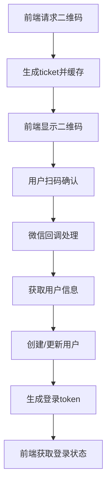

# 微信扫码登录完整实现流程分析

## 📱 扫码登录概述

微信扫码登录是现代Web应用的重要登录方式，提供了安全便捷的用户认证体验。本文档详细分析了基于DDD架构的微信扫码登录完整实现。

## 🔄 扫码登录核心流程



## 🔑 核心接口设计

### 1. 生成二维码接口
```java
GET /api/v1/login/weixin_qrcode_ticket
// 返回：ticket用于生成二维码
```

### 2. 检查登录状态接口
```java
GET /api/v1/login/check_login?ticket=xxx
// 返回：登录状态和用户token
```

### 3. 微信回调接口
```java
GET /api/v1/weixin/portal/callback?code=xxx&state=xxx
// 处理：微信授权回调，完成登录
```

## 💡 关键实现技术

### 1. 二维码生成机制
- 使用Snowflake算法生成唯一ticket
- ticket存入缓存，设置过期时间（如5分钟）
- 前端根据ticket调用微信API生成二维码图片

### 2. 登录状态管理
- ticket作为临时标识，关联登录状态
- 缓存存储：`ticket -> {status: "pending"|"success"|"expired", userId: "xxx"}`
- 前端轮询检查登录状态

### 3. 微信授权流程
```java
// 1. 用户扫码确认后，微信重定向
GET /callback?code=AUTH_CODE&state=TICKET

// 2. 使用code获取access_token
String accessToken = weixinApi.getAccessToken(code);

// 3. 获取用户信息
WeixinUser userInfo = weixinApi.getUserInfo(accessToken);

// 4. 创建或更新用户
User user = userService.createWeixinUser(userInfo);

// 5. 生成登录token
String token = jwtService.generate(user.getId());

// 6. 更新缓存状态
cacheService.put(ticket, {status: "success", token: token});
```

## 📁 文件结构分析

### 🎯 核心扫码登录文件（在study项目中）

#### 控制器层
```
📂 study/s-pay-mall-ddd/s-pay-mall-ddd-trigger/src/main/java/cn/bugstack/trigger/http/
├── 📄 LoginController.java
│   └── 作用：扫码登录HTTP接口
│   ├── GET /api/v1/login/weixin_qrcode_ticket (生成二维码)
│   └── GET /api/v1/login/check_login (检查登录状态)
```

#### 服务层
```
📂 study/s-pay-mall-ddd/s-pay-mall-ddd-domain/src/main/java/cn/bugstack/domain/auth/service/
├── 📄 WeixinLoginService.java
│   └── 作用：微信登录核心业务逻辑
│   ├── createQrCodeTicket() - 创建二维码ticket
│   ├── checkLogin(ticket) - 检查登录状态
│   └── saveLoginState(ticket, openid) - 保存登录状态
```

#### API接口定义
```
📂 study/s-pay-mall-ddd/s-pay-mall-ddd-api/src/main/java/cn/bugstack/api/
├── 📄 IAuthService.java
│   └── 作用：认证服务接口规范
```

#### 数据传输对象
```
📂 study/s-pay-mall-ddd/s-pay-mall-ddd-infrastructure/src/main/java/cn/bugstack/infrastructure/gateway/dto/
├── 📄 WeixinQrCodeRequestDTO.java (二维码请求参数)
├── 📄 WeixinQrCodeResponseDTO.java (二维码响应结果)
├── 📄 WeixinTokenResponseDTO.java (微信Token响应)
└── 📄 WeixinTemplateMessageDTO.java (模板消息)
```

#### 端口适配器
```
📂 study/s-pay-mall-ddd/s-pay-mall-ddd-infrastructure/src/main/java/cn/bugstack/infrastructure/adapter/port/
├── 📄 LoginPort.java
│   └── 作用：登录业务逻辑实现
```

#### 工具类
```
📂 study/s-pay-mall-ddd/s-pay-mall-ddd-types/src/main/java/cn/bugstack/types/sdk/weixin/
├── 📄 SignatureUtil.java (SHA1签名工具)
├── 📄 XmlUtil.java (XML解析工具)
└── 📄 MessageTextEntity.java (文本消息实体)
```

### 🔧 主项目微信相关文件

#### 控制器
```
📂 src/main/java/com/gaoyifeng/aioserver/trigger/
├── 📄 WeixinPortalController.java
│   └── 作用：微信公众号消息处理
│   ├── GET /api/v1/weixin/portal/receive (服务器验证)
│   └── POST /api/v1/weixin/portal/receive (消息接收)
```

#### 服务层
```
📂 src/main/java/com/gaoyifeng/aioserver/domain/weixin/service/
├── 📄 SignatureService.java (签名验证服务)
├── 📄 MessageService.java (消息处理服务)
└── 📄 CacheService.java (缓存服务)
```

#### 领域模型
```
📂 src/main/java/com/gaoyifeng/aioserver/domain/weixin/model/
├── 📄 entity/WeixinMessage.java (微信消息实体)
├── 📄 entity/Signature.java (签名值对象)
└── 📄 aggregate/MessageConversation.java (消息对话聚合根)
```

#### 端口接口
```
📂 src/main/java/com/gaoyifeng/aioserver/domain/weixin/adapter/port/
├── 📄 IWeixinApiPort.java (微信API接口)
├── 📄 ICachePort.java (缓存接口)
└── 📄 IMessageRepositoryPort.java (消息仓储接口)
```

#### 适配器实现
```
📂 src/main/java/com/gaoyifeng/aioserver/infrastructure/adapter/port/
├── 📄 WeixinApiPortAdapter.java (微信API适配器)
├── 📄 CachePortAdapter.java (缓存适配器)
└── 📄 MessageRepositoryAdapter.java (消息仓储适配器)
```

#### 工具类
```
📂 src/main/java/com/gaoyifeng/aioserver/infrastructure/util/
├── 📄 SignatureUtil.java (项目专用签名工具)
├── 📄 XmlUtil.java (XML解析工具)
└── 📄 SnowflakeIdWorker.java (雪花ID生成器)
```

### ⚙️ 配置文件

#### 配置类
```
📂 src/main/java/com/gaoyifeng/aioserver/infrastructure/config/
├── 📄 WeixinConfig.java (微信配置类)
├── 📄 GuavaConfig.java (缓存配置)
└── 📄 Retrofit2Config.java (HTTP客户端配置)
```

#### 配置文件
```
📂 src/main/resources/
├── 📄 application.yml (主配置)
├── 📄 application-dev.yml (开发环境)
│   └── 包含微信token、originalid等配置
└── 📄 application-prod.yml (生产环境)
```

### 🧪 测试文件
```
📂 src/test/java/com/gaoyifeng/aioserver/
├── 📄 WeixinPortalControllerTest.java (控制器测试)
├── 📄 SignatureServiceTest.java (签名服务测试)
└── 📄 MessageServiceTest.java (消息服务测试)
```

## 🛡️ 安全机制

### 1. 签名验证
```java
// 微信服务器验证SHA1签名
String signature = sha1(token + timestamp + nonce);
return signature.equals(weixinSignature);
```

### 2. 状态防伪造
- ticket使用雪花算法，确保唯一性
- state参数防止CSRF攻击
- 缓存过期机制防止重放攻击

### 3. Token安全
- 简化实现：直接使用userId作为token
- 生产环境建议：JWT加密 + 过期时间

## 🎯 核心业务逻辑

### 1. 二维码登录状态机
```
pending → success → expired
    ↓
  check_login轮询
```

### 2. 用户创建流程
```java
// 检查微信用户是否已存在
if (!userRepository.existsByOpenId(openId)) {
    // 创建新用户
    User newUser = User.createWeixinUser(openId, nickname, avatar);
    userRepository.save(newUser);
} else {
    // 更新用户信息
    User user = userRepository.findByOpenId(openId);
    user.updateProfile(nickname, avatar);
    userRepository.save(user);
}
```

### 3. Token验证机制
```java
public String validateToken(String token) {
    // 简化实现：直接返回userId
    // 实际应该验证JWT签名和过期时间
    return token;
}
```

## 🔧 技术特点

### 1. DDD架构实践
- 严格分层：API → Trigger → Domain → Infrastructure
- 领域驱动：User实体包含业务逻辑
- 依赖倒置：通过Port/Adapter解耦

### 2. 微信生态集成
- 支持公众号消息接收
- 自动回复机制
- 用户信息获取

### 3. 状态管理
- 使用Guava Cache管理临时状态
- 前后端分离的登录体验
- 轮询机制获取登录结果

## ⚠️ 注意事项

### 1. 简化设计点
- Token直接使用userId（生产环境应使用JWT）
- 密码明文存储（应使用BCrypt加密）
- 缺少Token过期机制

### 2. 可改进点
- 添加WebSocket实时推送登录状态
- 使用Redis分布式缓存替代本地缓存
- 完善异常处理和日志记录

## 📊 关键发现

### ✅ 已实现
- 微信公众号消息处理（主项目）
- 签名验证机制（主项目）
- XML消息解析（主项目）
- 扫码登录完整流程（study项目）

### ❌ 缺失
- 主项目中缺少扫码登录实现
- 需要将study项目的扫码登录逻辑迁移到主项目

### 🎯 核心流程文件
```
扫码登录核心文件：
├── LoginController.java (接口入口)
├── WeixinLoginService.java (业务逻辑)
├── LoginPort.java (技术实现)
└── WeixinQrCode*.java (数据模型)
```

## 🚀 实施建议

1. **迁移扫码登录功能**：将study项目的扫码登录逻辑迁移到主项目
2. **完善安全机制**：实现JWT Token、密码加密、请求限流
3. **优化用户体验**：使用WebSocket替代轮询，提升实时性
4. **增强监控**：添加登录日志、异常监控、性能指标
5. **扩展功能**：支持多端登录、设备管理、安全设置

---

*本文档基于AIOServer项目的微信扫码登录实现分析整理，为后续功能开发提供参考。*